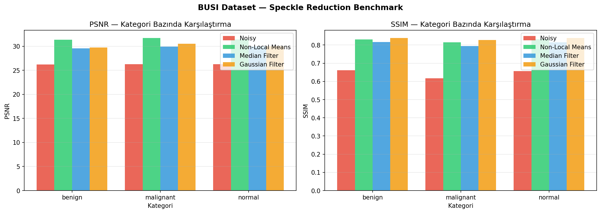
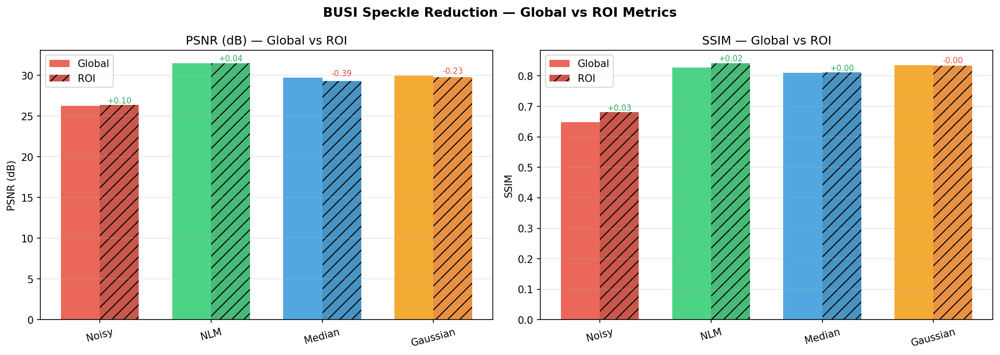

# Speckle Reduction Benchmark on BUSI Dataset

Comparison of classical denoising methods on breast ultrasound images,
evaluated both globally and within lesion ROI using segmentation masks.

## Dataset
[BUSI Dataset](https://www.kaggle.com/datasets/aryashah2k/breast-ultrasound-images-dataset) 
— 780 ultrasound images (benign / malignant / normal) with segmentation masks

## Methods
- Additive Gaussian noise (σ=0.05) as speckle proxy
- Non-Local Means (NLM)
- Median Filter
- Gaussian Filter

## Results

| Method | PSNR Global | SSIM Global | PSNR ROI | SSIM ROI |
|---|---|---|---|---|
| Noisy | 26.25 | 0.649 | 26.35 | 0.681 |
| Non-Local Means | **31.47** | 0.827 | **31.51** | 0.842 |
| Median Filter | 29.71 | 0.810 | 29.32 | 0.811 |
| Gaussian Filter | 29.99 | **0.836** | 29.76 | 0.833 |

## Key Finding

Global metrics alone can be misleading in medical imaging context:
- **NLM** performs consistently across global and ROI evaluation — robust to lesion boundaries
- **Median filter** shows notable PSNR drop in ROI (29.71 → 29.32), indicating edge blurring at lesion boundaries — clinically relevant degradation
- **Gaussian filter** shows similar but milder ROI degradation

ROI-based evaluation is more clinically meaningful than global metrics alone.

## Visualizations

## Next
- Deep learning approaches: DnCNN, U-Net
- Realistic correlated speckle noise model

## Stack
Python · OpenCV · scikit-image · NumPy · Matplotlib
